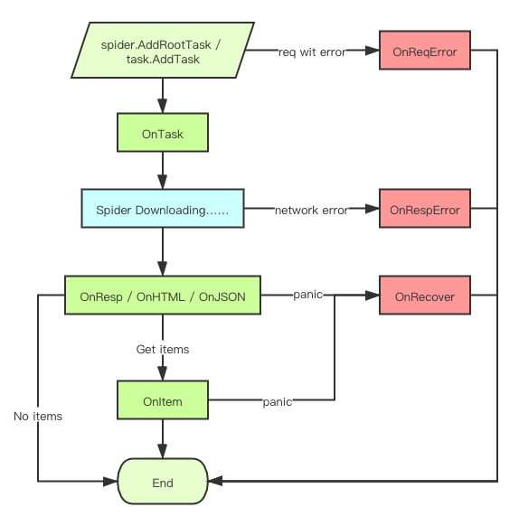

# Gospider

[](https://codecov.io/gh/zhshch2002/gospider)
[](https://goproxy.cn)

[](https://codecov.io/gh/zhshch2002/gospider)


- Gospider - https://github.com/zhshch2002/gospider
- Goreq - https://github.com/zhshch2002/goreq

`Gospider`是一个轻量友好的的Go爬虫框架。

`Gospider`在管理网络请求方面使用了`Goreq`。 **‌这样分割项目使功能划分更加明确，Gospider负责管理调度任务，Goreq负责处理网络请求。** 在`Gospider`中的`goreq.Request`、`goreq.Response`和`goreq.Client`由`Goreq`提供。

## 🚀 Feature

- **优雅的 API**
- **便于组织具有复杂层级和逻辑的代码**
- **友善的分布式支持**
- **一些细节** 相对链接自动转换、字符编码自动解码、HTML/JSON 自动解析
- **丰富的扩展支持** 自动去重、失败重试、记录异常请求、控制延时、随机延时、并发、速率、Robots.txt 支持、随机 UA
- **轻量** 适于学习或快速开箱搭建

## ⚡ 网络请求

```
go get -u github.com/zhshch2002/goreq
```

`Gospider`依赖`Goreq`描述、完成网络请求，这是一个`Goreq`的简单演示，如需更多资料请查阅[Goreq GitHub repo](https://github.com/zhshch2002/goreq)或者[使用文档](https://wiki.xzhsh.ch/goreq/)。

```go
fmt.Println(goreq.Get("https://httpbin.org/get").AddParam("A","a").Do().Txt())
```

结果是：

```json
{
  "args": {
    "A": "a"
  }, 
  "headers": {
    "Accept-Encoding": "gzip", 
    "Host": "httpbin.org", 
    "User-Agent": "Go-http-client/2.0", 
    "X-Amzn-Trace-Id": "Root=1-6017ae9d-109027b5452abdd849d0161b"
  }, 
  "origin": "221.219.65.152", 
  "url": "https://httpbin.org/get?A=a"
}
```

此外：

- `resp.Resp() (*Response, error)` 获取响应本身以及网络请求错误。
- `resp.Txt() (string, error)` 自动处理完编码并解析为文本后的内容以及网络请求错误。
- `resp.HTML() (*goquery.Document, error)`解析为HTML
- `resp.XML() (*xmlpath.Node, error)`解析为XML
- `resp.BindXML(i interface{}) error`将XML绑定到struct
- `resp.JSON() (gjson.Result, error)`解析为JSON
- `resp.BindJSON(i interface{}) error`将Json绑定到struct
- `resp.Error() error` 网络请求错误。（正常情况下为`nil`）

`Goreq`可以设置中间件、更换Http Client。请见[Goreq 使用文档](https://wiki.xzhsh.ch/goreq/)。

## ⚡ 快速开始

```shell
go get -u github.com/zhshch2002/gospider
```

第一个例子：

```go
package main

import (
	"github.com/zhshch2002/goreq"
	"github.com/zhshch2002/gospider"
)

func main() {
	s := gospider.NewSpider() // create spider

	s.OnResp(func(t *gospider.Task) {
		t.Println("this callback will process all response")
	})

	s.OnItem(func(t *gospider.Task, i interface{}) interface{} { // collect and save crawl result
		t.Println(i)
		return i
	})

	s.AddRootTask(
		goreq.Get("https://httpbin.org/get"),
		func(t *gospider.Task) { // this callback will only handle this request
			t.AddItem(t.Text) // submit result into OnItem pipeline
		},
	)

	s.Wait()
}

```

这是一个简单的爬虫，向`https://httpbin.org/get`发送请求并将结果作为`Item`存入`Spider`，`Gospider`会异步处理`OnItem`结果，不阻塞爬虫进程。

## 任务（Task）

```go
type Task struct {
   *goreq.Response
   s        *Spider
   Handlers []Handler
   Meta     map[string]interface{}
   abort    bool
}
```

任务本身就是爬虫能执行的最小单位。其中包含了请求（`Req`在`*goreq.Response`中）,此任务的处理函数Handlers，以及由上一个任务传递下来，并且会交给下一个任务的Meta数据。

### Abort

```go
func main() {
   s := gospider.NewSpider() // create spider

   s.OnResp(func(t *gospider.Task) {
      t.Println("yep") // this will working as first handler
   })

   s.AddRootTask(
      goreq.Get("https://httpbin.org/get"),
      func(t *gospider.Task) {
         t.AddItem(t.Text) // this is second handler
         t.Abort() // abort handler pipeline here
      },
      func(t *gospider.Task) {
         t.Println("this wont be print")
      },
   )

   s.Wait()
}
```

### 新任务和Meta

有些情况下我们需要根据爬去的数据发起新的任务，比如抓去一个页面上的所有链接的内容。

`s.AddRootTask`正如其名，是用来创建根任务，意味着这个任务不是由任何正在执行的任务创建的。简而言之，爬去在第`0`层。其实`Gospider`中的任务都是从`Task`中创建来的，使用`Task.AddTask`函数。`s.AddRootTask`本身也创建了一个空Task，并调用了`nilTask.AddTask`。

```go
func main() {
   s := gospider.NewSpider() // create spider

   s.AddRootTask(
      goreq.Get("https://httpbin.org/"),
      func(t *gospider.Task) {
         h, _ := t.HTML()
         t.Meta["form"] = t.Req.URL

         h.Find("a[href]").Each(func(i int, sel *goquery.Selection) {
            t.AddTask(
               goreq.Get(sel.AttrOr("href", "")),
               func(t2 *gospider.Task) {
                  t2.Println(t2.Status, t2.Req.URL, "from", t2.Meta["form"])
               },
            )
         })
      },
   )

   s.Wait()
}
```

`t.AddTask`就是在蜘蛛运行中创建任务的方式。这样创建的任务带有执行的上下文，可以方便中间件和扩展计算爬去深度等重要数据。

例子中出现的`Meta`。在一个任务中设置的`Meta`数据，会被拷贝到新任务的`Meta`中，也就是继承上一级`Meta`的数据。如此可以在任务之间传递数据。

## 回调函数

在上面的例子中，实现爬虫功能主体的是`s.OnItem`，`s.OnResp`和`s.AddRootTask`里的回调函数。Gospider中对爬虫执行的不同阶段都可以设置回调函数，回调函数是Gospider处理数据的主要方式，其分为两类，对爬虫本体设置的**生命周期回调函数**和**任务自身处理函数**。

下面是Gospider所有的**生命周期回调函数**：

* **OnTask(fn func(o, t *Task) *Task)** 创建新任务时调用，o为当前任务，t为新任务。
* **OnResp(fn func(t *Task))**
* **OnJSON(q string, fn func(t *Task, j gjson.Result))**
* **OnHTML(selector string, fn func(t *Task, sel *goquery.Selection))**
* **OnItem(fn func(t *Task, i interface{}) interface{})**
* **OnRecover(fn func(t *Task, err error))** 当OnResp、OnItem或任务处理函数panic时调用。
* **OnRespError(fn func(t *Task, err error))** 当Response的Err属性不为空时调用。
* **OnReqError(fn func(t *Task, err error))** 当Request的Err属性不为空时调用。




### Pipeline与Abort

上述回调中`OnTask(fn func(o, t *Task) *Task)`和`OnItem(fn func(t *Task, i interface{}) interface{})`都带有返回值。

当注册多个`OnItem`时，上一个`OnItem`的返回值将会被传递给下一个`OnItem`，这将处理时修改`item`成为可能。同时，在此处返回`nil`将会中断此后的回调函数，中断后的回调函数都不会被执行。

```go
package main

import (
   "github.com/zhshch2002/goreq"
   "github.com/zhshch2002/gospider"
)

func main() {
   s := gospider.NewSpider() // create spider

   s.OnItem(func(t *gospider.Task, i interface{}) interface{} {
      t.Println(i) // this is working
      return "yes!!"
   })

   s.OnItem(func(t *gospider.Task, i interface{}) interface{} {
      t.Println(i) // this is working
      return nil
   })

   s.OnItem(func(t *gospider.Task, i interface{}) interface{} {
      // this on item will never be called because last OnItem return nil
      t.Println(i)
      return i
   })

   s.AddRootTask(
      goreq.Get("https://httpbin.org/get"),
      func(t *gospider.Task) { // this callback will only handle this request
         t.AddItem(t.Text) // submit result into OnItem pipeline
      },
   )

   s.Wait()
}
```

`OnTask`中返回`nil`与直接`Abort()`的作用一致，`nil`与`Abort()`都会中断整个任务，包括`OnTask`和之后的任何回调、处理函数。

## 扩展与中间件

```go
s := gospider.NewSpider() // create spider

s.Use(gospider.WithDeduplicate())
s.Use(goreq.WithRandomUA())
```

上述程序中使用了两个中间件或扩展。一个是Goreq提供的内建中间件，一个是Gospider提供的内建扩展。

Use能接受的类型如下：

* **func(*goreq.Client, goreq.Handler) goreq.Handler** 这是`Goreq`的中间件，使用时将会直接调用`Spider`的`Goreq`的`Client`注册中间件。详细请参考Goreq的使用文档。
* **func(s *gospider.Spider)**

由此可见，Gospider的扩展（不称之为中间件）本事是对Spider的一个配置函数。扩展的功能是通过注册回调函数来实现的。

```go
func WithDeduplicate() Extension {
   return func(s *Spider) {
      CrawledHash := map[string]struct{}{}
      lock := sync.Mutex{}
      s.OnTask(func(o, t *Task) *Task {
         has := goreq.GetRequestHash(t.Req)
         lock.Lock()
         defer lock.Unlock()
         if _, ok := CrawledHash[has]; ok {
            return nil
         }
         CrawledHash[has] = struct{}{}
         return t
      })
   }
}
```

这是内建的请求去重的扩展。

### 内建扩展

#### WithDeduplicate

```go
func WithDeduplicate() Extension
```

根据`goreq.GetRequestHash`计算请求的哈希，在`OnTask`中`drop`已有的请求。

#### WithRobotsTxt

```go
func WithRobotsTxt(ua string) Extension
```

自动处理`robots.txt`，参数为当前蜘蛛的`ua`。

#### WithDepthLimit

```go
func WithDepthLimit(max int) Extension
```

限制爬取的最大深度。将在`Request`的`Context`中`WithValue`来记录当前深度，`key`为`depth`。超过限制将在`OnTask`阶段被`drop`。

#### WithMaxReqLimit

```go
func WithMaxReqLimit(max int64) Extension
```

使用`OnTask`限制最多请求数量。

#### WithErrorLog

```go
func WithErrorLog(f io.Writer) Extension
```

当`AddItem`是一个`error`类型时，记录`log`。

可以用来记录爬行时遇到的问题，如反爬虫程序和验证码等。

#### WithCsvItemSaver

```go
func WithCsvItemSaver(f io.Writer) Extension
```

将记录的`Item`写入`csv`文件中。

## 关于“气功波”式的代码

使用回调函数，以及Golang的闭包函数，无可奈何的会写出这样的代码。

```go
func crawl() {
   s := gospider.NewSpider() // create spider

   s.AddRootTask(
      goreq.Get("https://example.com/"),
      func(t *gospider.Task) {
         h, _ := t.HTML()
         h.Find("div.a a[href]").Each(func(i int, sel *goquery.Selection) {
            t.AddTask(
               goreq.Get(sel.AttrOr("href", "")),
               func(t *gospider.Task) {
                  h, _ := t.HTML()
                  h.Find("div.b a[href]").Each(func(i int, sel *goquery.Selection) {
                     t.AddTask(
                        goreq.Get(sel.AttrOr("href", "")),
                        func(t *gospider.Task) {
                           h, _ := t.HTML()
                           h.Find("div.a a[href]").Each(func(i int, sel *goquery.Selection) {
                              t.AddTask(
                                 goreq.Get(sel.AttrOr("href", "")),
                                 func(t *gospider.Task) {

                                 },
                              )
                           })
                        },
                     )
                  })
               },
            )
         })
      })
}
```

就像是一个冲击波一样无限递进。

这个程序没有问题，正确的使用了框架。但是，不好看，也不优雅。

`Gospider`不限制程序具体如何编写，如果临时或者维护需求小且开发时间短，这样的程序很适合。

同时，`Gospider`还建议这样编写同样的爬虫。

```go
type MySpider struct {}

func (m *MySpider) handler3(t *gospider.Task) {
   t.Println("hello", t.Req.URL)
}

func (m *MySpider) handler2(t *gospider.Task) {
   h, _ := t.HTML()
   h.Find("div.b a[href]").Each(func(i int, sel *goquery.Selection) {
      t.AddTask(
         goreq.Get(sel.AttrOr("href", "")),
         m.handler3,
      )
   },
   )
}

func (m *MySpider) handler1(t *gospider.Task) {
   h, _ := t.HTML()
   h.Find("div.b a[href]").Each(func(i int, sel *goquery.Selection) {
      t.AddTask(
         goreq.Get(sel.AttrOr("href", "")),
         m.handler2,
      )
   },
   )
}

func (m *MySpider) start() {
   s := gospider.NewSpider() // create spider

   s.AddRootTask(
      goreq.Get("https://example.com/"),
      m.handler1,
   )
}
```

## 关于分布式

`Gospider`本身没有分布式扩展或者支持，但也在积极探索相关功能和需求。

本身分布式要求对爬虫任务十分依赖而且因情况而异。通常可以分布式化的有**任务派发**、**网络请求（代理）**、**数据处理**、**结果收集**等。

`Golang`本身提供了十分便利的环境使得这些部分可以在不破坏`Gospider`的情况下轻松实现。`Gospider`也会在将来把分布式化纳入计划中。